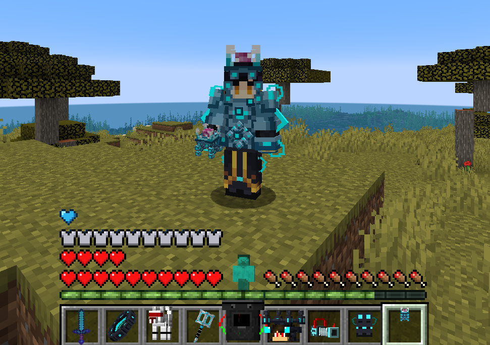
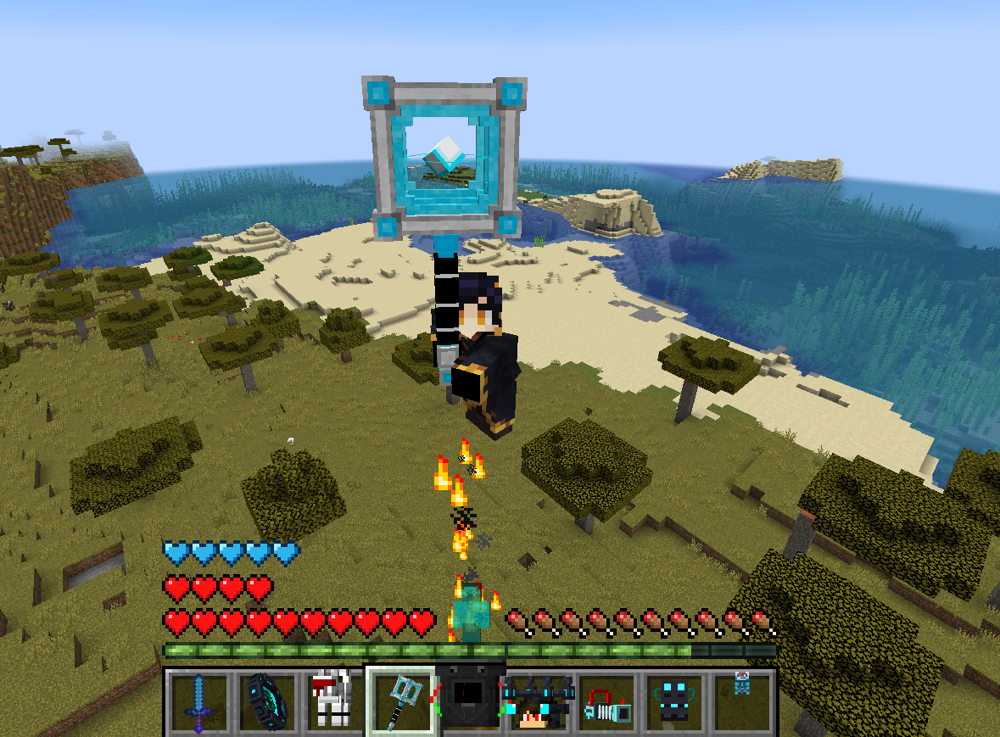
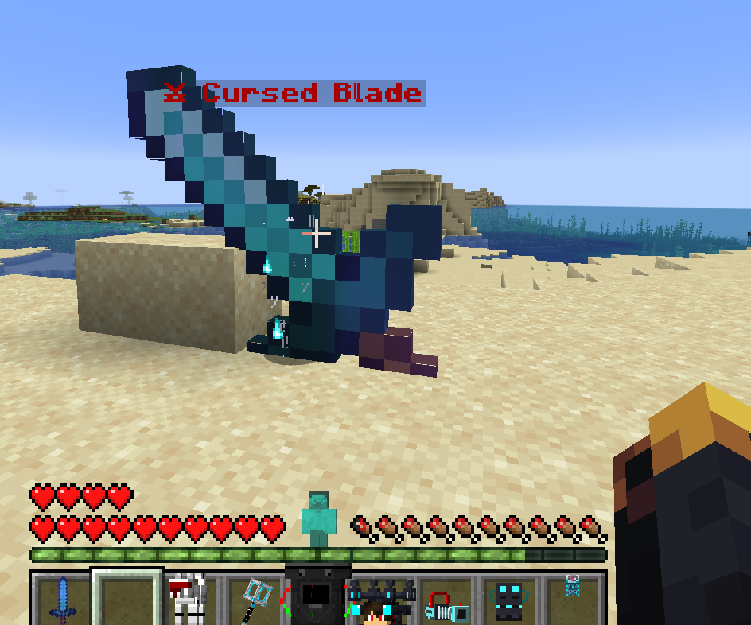
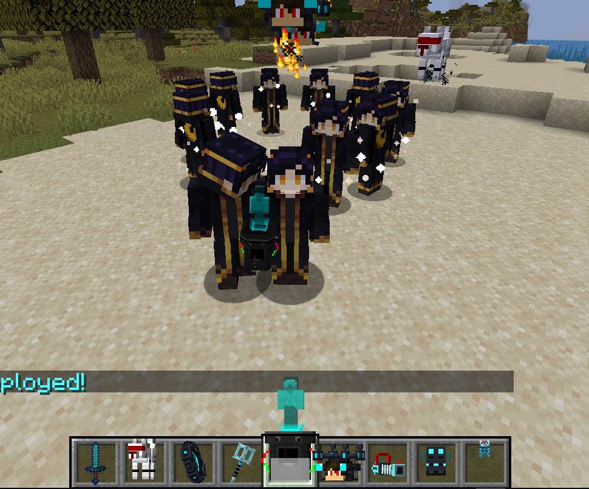

# CYBERNETIC FRAMEWORK

Futuristic Minecraft gameplay framework focused on cybernetic combat systems, reactive equipment mechanics, companion AI behavior, and advanced utility-based gameplay interactions.

---

## Overview

Cybernetic Framework introduces a collection of advanced gameplay systems centered around futuristic combat mechanics, intelligent utility tools, and enhanced player interaction systems.

The project combines mobility mechanics, reactive combat equipment, AI-assisted gameplay, and custom utility systems to create a high-tech gameplay experience inside Minecraft.

---

## Core Features

- Reactive cybernetic armor systems
- Shockwave-based combat mechanics
- AI companion weapon behavior
- Summonable robotic support systems
- Mobility-enhancing utility tools
- Advanced combat interaction systems
- Custom visual and gameplay effects

---

## Gameplay Systems

The project is designed around fast-paced combat interactions and advanced utility-driven gameplay mechanics.

Included systems:
- Reactive electric armor behavior
- Shockwave hammer mechanics
- AI-controlled sword companion
- Personal robotic combat systems
- Utility-focused cyber equipment
- Enhanced mobility interactions

---

## Technical Overview

- Modular gameplay architecture
- Custom AI behavior systems
- Client/server gameplay synchronization
- Combat interaction processing
- Event-driven gameplay mechanics
- Optimized entity and effect handling

---

## Preview

  

  

  

  

---

## Status

Active gameplay systems project under continued development.
